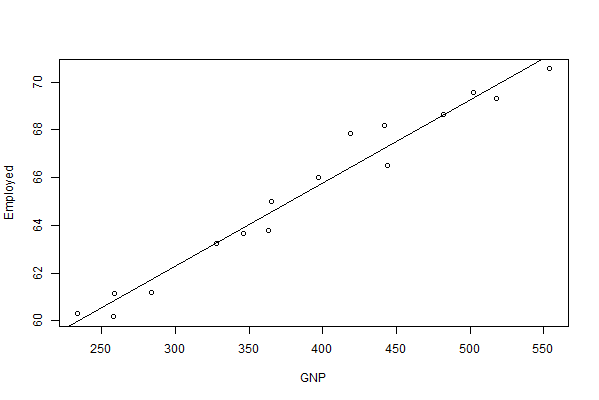

Presentation on Economic Regression analysis Shiny App by Prakash
========================================================
author: Prakash Khadka
date: 25/05/2016
autosize: true
transition: linear


Description
========================================================


<font size="6">
The following presentation works on the longley data set which has been used for creating a shiny app for visualizing the longely data of economic regression.

The shiny application is available here: <https://prkhadka.shinyapps.io/Developing_Data_Products/>

This application takes in the macroeconomic data set and plots the regression model 
using two predictors, one of which is the no of employed people for yeas from 1954 to 1962 versus any predictor selected by the user.

It also contains another interactive graph which plots comparison amongst some variables.
</font>

Shiny Snapshot
========================================================
type: prompt

<div class="row">
  <div class="col-md-8" align="center">
  <p class="text-primary">Attached is the snap shot of my shiny app.</p>
  
  
  </div>
  
</div>

R expression Code and Evaluator
========================================================
type: prompt

<font size="5">
Below is the embedded r expression code, which is evaluated in the pitching


```r
# rCharts package loading, it needs to be isolated from other packages
library(rCharts)
```

```r
# Other package for data transformations
library(data.table)
# Load the dataset
data <- longley

# Create the Scatter chart
 myChart<-nPlot(Employed~Unemployed, group ='Employed',data=data
                   , type = "multiBarChart")
  #Display customized tool tip 
  myChart$chart(tooltipContent = "#! function(key, x, y, e){
                  return '<h2>' + e.point.Employed + '</h2>'} !#")
  myChart$xAxis(axisLabel='No of Unemployed people')
  myChart$yAxis(axisLabel='No of employed people')
```
</font>


Chart Generation
========================================================

<font size="6">The above code generated the chart below .


```r
myChart$show('iframesrc', cdn = TRUE) # Display the rchart through r expression evaluation
```

<iframe srcdoc=' &lt;!doctype HTML&gt;
&lt;meta charset = &#039;utf-8&#039;&gt;
&lt;html&gt;
  &lt;head&gt;
    &lt;link rel=&#039;stylesheet&#039; href=&#039;//cdnjs.cloudflare.com/ajax/libs/nvd3/1.1.15-beta/nv.d3.min.css&#039;&gt;
    
    &lt;script src=&#039;//ajax.googleapis.com/ajax/libs/jquery/1.8.2/jquery.min.js&#039; type=&#039;text/javascript&#039;&gt;&lt;/script&gt;
    &lt;script src=&#039;//d3js.org/d3.v3.min.js&#039; type=&#039;text/javascript&#039;&gt;&lt;/script&gt;
    &lt;script src=&#039;//cdnjs.cloudflare.com/ajax/libs/nvd3/1.1.15-beta/nv.d3.min.js&#039; type=&#039;text/javascript&#039;&gt;&lt;/script&gt;
    &lt;script src=&#039;//nvd3.org/assets/lib/fisheye.js&#039; type=&#039;text/javascript&#039;&gt;&lt;/script&gt;
    
    &lt;style&gt;
    .rChart {
      display: block;
      margin-left: auto; 
      margin-right: auto;
      width: 800px;
      height: 400px;
    }  
    &lt;/style&gt;
    
  &lt;/head&gt;
  &lt;body &gt;
    
    &lt;div id = &#039;chart1380214e56dd&#039; class = &#039;rChart nvd3&#039;&gt;&lt;/div&gt;    
    &lt;script type=&#039;text/javascript&#039;&gt;
 $(document).ready(function(){
      drawchart1380214e56dd()
    });
    function drawchart1380214e56dd(){  
      var opts = {
 &quot;dom&quot;: &quot;chart1380214e56dd&quot;,
&quot;width&quot;:    800,
&quot;height&quot;:    400,
&quot;x&quot;: &quot;Unemployed&quot;,
&quot;y&quot;: &quot;Employed&quot;,
&quot;group&quot;: &quot;Employed&quot;,
&quot;type&quot;: &quot;multiBarChart&quot;,
&quot;id&quot;: &quot;chart1380214e56dd&quot; 
},
        data = [
 {
 &quot;GNP.deflator&quot;:             83,
&quot;GNP&quot;:        234.289,
&quot;Unemployed&quot;:          235.6,
&quot;Armed.Forces&quot;:            159,
&quot;Population&quot;:        107.608,
&quot;Year&quot;: 1947,
&quot;Employed&quot;:         60.323 
},
{
 &quot;GNP.deflator&quot;:           88.5,
&quot;GNP&quot;:        259.426,
&quot;Unemployed&quot;:          232.5,
&quot;Armed.Forces&quot;:          145.6,
&quot;Population&quot;:        108.632,
&quot;Year&quot;: 1948,
&quot;Employed&quot;:         61.122 
},
{
 &quot;GNP.deflator&quot;:           88.2,
&quot;GNP&quot;:        258.054,
&quot;Unemployed&quot;:          368.2,
&quot;Armed.Forces&quot;:          161.6,
&quot;Population&quot;:        109.773,
&quot;Year&quot;: 1949,
&quot;Employed&quot;:         60.171 
},
{
 &quot;GNP.deflator&quot;:           89.5,
&quot;GNP&quot;:        284.599,
&quot;Unemployed&quot;:          335.1,
&quot;Armed.Forces&quot;:            165,
&quot;Population&quot;:        110.929,
&quot;Year&quot;: 1950,
&quot;Employed&quot;:         61.187 
},
{
 &quot;GNP.deflator&quot;:           96.2,
&quot;GNP&quot;:        328.975,
&quot;Unemployed&quot;:          209.9,
&quot;Armed.Forces&quot;:          309.9,
&quot;Population&quot;:        112.075,
&quot;Year&quot;: 1951,
&quot;Employed&quot;:         63.221 
},
{
 &quot;GNP.deflator&quot;:           98.1,
&quot;GNP&quot;:        346.999,
&quot;Unemployed&quot;:          193.2,
&quot;Armed.Forces&quot;:          359.4,
&quot;Population&quot;:         113.27,
&quot;Year&quot;: 1952,
&quot;Employed&quot;:         63.639 
},
{
 &quot;GNP.deflator&quot;:             99,
&quot;GNP&quot;:        365.385,
&quot;Unemployed&quot;:            187,
&quot;Armed.Forces&quot;:          354.7,
&quot;Population&quot;:        115.094,
&quot;Year&quot;: 1953,
&quot;Employed&quot;:         64.989 
},
{
 &quot;GNP.deflator&quot;:            100,
&quot;GNP&quot;:        363.112,
&quot;Unemployed&quot;:          357.8,
&quot;Armed.Forces&quot;:            335,
&quot;Population&quot;:        116.219,
&quot;Year&quot;: 1954,
&quot;Employed&quot;:         63.761 
},
{
 &quot;GNP.deflator&quot;:          101.2,
&quot;GNP&quot;:        397.469,
&quot;Unemployed&quot;:          290.4,
&quot;Armed.Forces&quot;:          304.8,
&quot;Population&quot;:        117.388,
&quot;Year&quot;: 1955,
&quot;Employed&quot;:         66.019 
},
{
 &quot;GNP.deflator&quot;:          104.6,
&quot;GNP&quot;:         419.18,
&quot;Unemployed&quot;:          282.2,
&quot;Armed.Forces&quot;:          285.7,
&quot;Population&quot;:        118.734,
&quot;Year&quot;: 1956,
&quot;Employed&quot;:         67.857 
},
{
 &quot;GNP.deflator&quot;:          108.4,
&quot;GNP&quot;:        442.769,
&quot;Unemployed&quot;:          293.6,
&quot;Armed.Forces&quot;:          279.8,
&quot;Population&quot;:        120.445,
&quot;Year&quot;: 1957,
&quot;Employed&quot;:         68.169 
},
{
 &quot;GNP.deflator&quot;:          110.8,
&quot;GNP&quot;:        444.546,
&quot;Unemployed&quot;:          468.1,
&quot;Armed.Forces&quot;:          263.7,
&quot;Population&quot;:         121.95,
&quot;Year&quot;: 1958,
&quot;Employed&quot;:         66.513 
},
{
 &quot;GNP.deflator&quot;:          112.6,
&quot;GNP&quot;:        482.704,
&quot;Unemployed&quot;:          381.3,
&quot;Armed.Forces&quot;:          255.2,
&quot;Population&quot;:        123.366,
&quot;Year&quot;: 1959,
&quot;Employed&quot;:         68.655 
},
{
 &quot;GNP.deflator&quot;:          114.2,
&quot;GNP&quot;:        502.601,
&quot;Unemployed&quot;:          393.1,
&quot;Armed.Forces&quot;:          251.4,
&quot;Population&quot;:        125.368,
&quot;Year&quot;: 1960,
&quot;Employed&quot;:         69.564 
},
{
 &quot;GNP.deflator&quot;:          115.7,
&quot;GNP&quot;:        518.173,
&quot;Unemployed&quot;:          480.6,
&quot;Armed.Forces&quot;:          257.2,
&quot;Population&quot;:        127.852,
&quot;Year&quot;: 1961,
&quot;Employed&quot;:         69.331 
},
{
 &quot;GNP.deflator&quot;:          116.9,
&quot;GNP&quot;:        554.894,
&quot;Unemployed&quot;:          400.7,
&quot;Armed.Forces&quot;:          282.7,
&quot;Population&quot;:        130.081,
&quot;Year&quot;: 1962,
&quot;Employed&quot;:         70.551 
} 
]
  
      if(!(opts.type===&quot;pieChart&quot; || opts.type===&quot;sparklinePlus&quot; || opts.type===&quot;bulletChart&quot;)) {
        var data = d3.nest()
          .key(function(d){
            //return opts.group === undefined ? &#039;main&#039; : d[opts.group]
            //instead of main would think a better default is opts.x
            return opts.group === undefined ? opts.y : d[opts.group];
          })
          .entries(data);
      }
      
      if (opts.disabled != undefined){
        data.map(function(d, i){
          d.disabled = opts.disabled[i]
        })
      }
      
      nv.addGraph(function() {
        var chart = nv.models[opts.type]()
          .width(opts.width)
          .height(opts.height)
          
        if (opts.type != &quot;bulletChart&quot;){
          chart
            .x(function(d) { return d[opts.x] })
            .y(function(d) { return d[opts.y] })
        }
          
         
        chart
  .tooltipContent( function(key, x, y, e){
                  return &#039;&lt;h2&gt;&#039; + e.point.Employed + &#039;&lt;/h2&gt;&#039;} )
          
        chart.xAxis
  .axisLabel(&quot;No of Unemployed people&quot;)

        
        
        chart.yAxis
  .axisLabel(&quot;No of employed people&quot;)
      
       d3.select(&quot;#&quot; + opts.id)
        .append(&#039;svg&#039;)
        .datum(data)
        .transition().duration(500)
        .call(chart);

       nv.utils.windowResize(chart.update);
       return chart;
      });
    };
&lt;/script&gt;
    
    &lt;script&gt;&lt;/script&gt;    
  &lt;/body&gt;
&lt;/html&gt; ' scrolling='no' frameBorder='0' seamless class='rChart  nvd3  ' id='iframe-chart1380214e56dd'> </iframe>
 <style>iframe.rChart{ width: 100%; height: 400px;}</style>

<p align="center">Devloped by Prakash Khadka</p>
</font>
